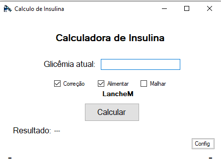
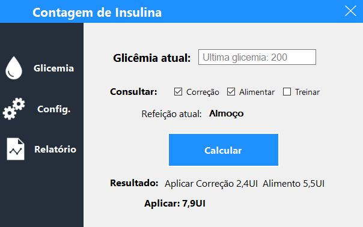
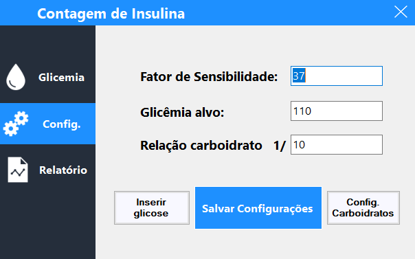
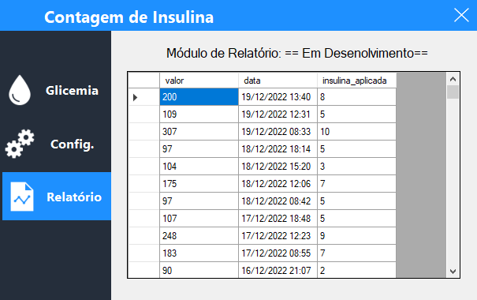
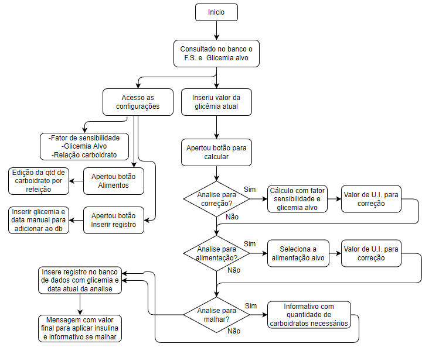
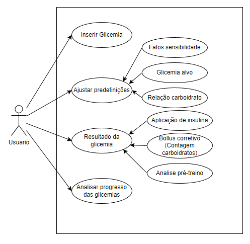

# Contagem de Insulina

#### _Para um melhor controle e gestao da insulina a ser aplicada_

   

Contagem de insulina trata de um software para auxiliar na correcao, contagem de carboidratos e analise para realizacao de exercicio fisico, pensando na melhor qualidade de vida para o utilizado.

- Auxilia de forma rapida e pratica a saber a quantidade de insulina a ser aplicada.
- Permite realizar uma analise se é viavel ou não realizar exercicio fisico.
- Possibilidade acompanhar o desenvolvimento glicemico do usuario e muito mais.

## Funcionalidades

- Analises possiveis para a glicemia: Correcao, Alimentacao(Contagem de carboidratos) e Exercicio fisico
- Sistema monitorando o momento do dia para sugerir a alimententacao atual
- Analise geral da acao a ser tomada a partir do valor da glicose e parametros escolhidos para analise
- Possibilidade de inserir todos os parametros como: Fator sensibilidade, Glicemia alvo, Relacao carboidrato, etc
- Possibilidade de ajustar a quantidade de carboidratos por refeicao

### Autor

- Edgar Oliveira Cardoso

### Versoes

> Versao 1.0
> Versao inicial, contando com as funcionalidades ativas e garantindo um controle eficaz da glicemia

Imagens:

---

> Versao 2.0
> Design estruturado, módulo de relatório adicionado, e modelo unique page com navegação lateral

Imagens:

### Diagramas representando a funcionalidade do sistema:

Fluxograma

Diagrama de Caso de Uso

